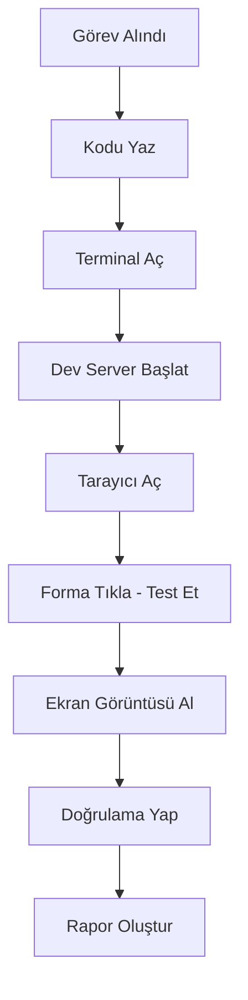

# Antigravity IDE - Öğrenme Notları

Bu doküman Antigravity IDE hakkında çeşitli kaynaklardan topladığımız önemli notları, örnekleri ve içgörüleri içerir.

---

## 📺 Video Transkript Notları

**Kaynak:** YouTube video analizi (23 Kasım 2025)

### Temel Kavram Değişimi

> "Bu başka bir kod düzenleyici değil. Bu başka bir yapay zeka asistanı da değil. Bu en baştan ajan odaklı bir geliştirme ortamı."

**Önemli Fark:**
- Diğer AI araçlar (Cursor, Copilot): **Yardımcı olur**
- Antigravity: **İşi kendisi yapar**

### Rol Değişimi

```
Eski Paradigma:
Sen = Kod Yazıyorsun
AI = Öneri Veriyor

Yeni Paradigma (Antigravity):
Sen = Yönetici
AI Ajanları = İşi Yapıyor
```

**Benzetme:** Yanında tam bir yazılım ekibi varmış gibi.

---

## 🎯 Pratik Kullanım Örneği

### Senaryo: "Bir giriş formu oluştur"

**Agent'ın Adımları:**



**Öne Çıkan:** End-to-end doğrulama - Agent sadece kod yazmıyor, çalıştığını da kendi doğruluyor!

---

## 🤖 Çoklu Ajan Koordinasyonu

### Paralel Çalışma Örneği

```
Proje: E-ticaret sitesi

Agent 1 (Frontend) → React UI kuruyor
    ↓
Agent 2 (Testing)  → Unit testler yazıyor
    ↓
Agent 3 (Backend)  → API endpointleri yazıyor
    ↓
Agent 4 (QA)       → Bug fixing yapıyor
```

**Sonuç:** Tek agent'la 4 saat sürecek iş, 4 agent'la 1 saatte bitiyor.

---

## 📊 Artifact Sistemi - İletişim Köprüsü

### Neden Önemli?

Ajanlar asenkron çalışıyor. Sen her saniye takip edemezsin. Artifact'lar sana **özet rapor** sunuyor.

### Artifact Türleri ve Kullanımları

| Artifact Türü | Ne İçerir | Ne Zaman Oluşur |
|---------------|-----------|-----------------|
| **Task List** | Yapılacaklar listesi | Planning mode başında |
| **Implementation Plan** | Teknik detaylar, dosya değişiklikleri | Kod yazmadan önce |
| **Walkthrough** | Yapılanların özeti | İş bitiminde |
| **Screenshots** | Ekran görüntüleri | Browser agent çalışırken |
| **Browser Recordings** | Video kayıtları | UI testlerinde |

### Feedback Döngüsü

```
1. Agent → Implementation Plan oluşturur
2. Sen → "Bu kısım yanlış" diye yorum bırakırsın
3. Agent → Planı günceller
4. Sen → "Proceed" dersen devam eder
```

**Gerçek bir beraber çalışma deneyimi!**

---

## 🧠 Knowledge Items - Kalıcı Bellek

### Nasıl Çalışıyor?

```
Conversation 1: "React'te form validation yap"
    ↓
    Knowledge Item oluşur: "React form validation pattern"
    ↓
Conversation 2: "Başka bir formda validation lazım"
    ↓
    Agent otomatik hatırlıyor: "Geçen sefer şöyle yapmıştık"
    ↓
    Daha hızlı, daha isabetli sonuç
```

### Pratik Örnek

Video'dan alıntı:
> "Geçen hafta yaptığın bir şeye benzer bir istek verdiğinde senin tarzını zaten tanıyor ve işi daha hızlı, daha isabetli yapıyor."

**Fayda:** Her döngüde verim artıyor, agent senin tarzını öğreniyor.

---

## 💻 Sistem Gereksinimleri

### Minimum vs Önerilen

| Özellik | Minimum | Önerilen | Notlar |
|---------|---------|----------|--------|
| **RAM** | 8 GB | 16 GB | 8 GB'de yavaşlama olabilir |
| **OS** | Windows 10 64-bit | Windows 11 | - |
| | macOS 12 (Monterey) | macOS 14+ | X86 desteklenmiyor |
| | Ubuntu 20.04 | Ubuntu 22.04+ | glibc >= 2.28 |
| **Disk** | 2 GB | 5 GB | Workspace hariç |
| **Network** | Stabil internet | Fiber/ADSL | Gemini 3 Pro cloud'da |

---

## ⚠️ Önemli Uyarılar - Video'dan

### 1. Sürüm Kontrolü Şart

Video'nun en çok vurguladığı nokta:
> "Sürüm kontrolü artık tercihe bağlı değil. Bir zorunluluk."

**Sebep:** Agent bir adımda beklenmedik değişiklik yapabilir. Geri dönebilmelisin.

### 2. Kodu Anlamaya Devam Et

> "Ajanların ürettiği her şeyi sorgusuz, sualsiz kabul etmek doğru değil. İncele, doğrula, yorum yap."

**Kural:** Agent = Güçlü araç, Sihirli değnek değil.

### 3. Henüz Önizleme Döneminde

Video'nun tavsiyesi:
- ✅ Dene, öğren, sınırlarını gör
- ⚠️ Kritik production'a hemen taşıma
- ❌ Yedeksiz kullanma

---

## 🎓 Öğrenme Eğrisi - Video'nun Tavsiyesi

### Aşama 1: Deneme (İlk Günler)
```
- Basit bir TODO app yap
- Artifakt'ları incele
- Agent'ın nasıl düşündüğünü gör
```

### Aşama 2: Keşfetme (İlk Hafta)
```
- Daha büyük projeler dene
- Browser agent ile UI testleri yap
- Çoklu agent kullanmayı öğren
```

### Aşama 3: Uzmanlaşma (İlk Ay)
```
- MCP serverları entegre et
- Knowledge Items'ı optimize et
- Kendi workflow'unu oluştur
```

---

## 📈 Model Karşılaştırması

### Gemini 3 Pro vs Diğerleri

| Model | Rate Limit | Hız | Kalite | Kullanım Alanı |
|-------|-----------|-----|--------|----------------|
| **Gemini 3 Pro (High)** | Generous | Orta | Yüksek | Kompleks görevler |
| **Gemini 3 Pro (Low)** | Cömert | Hızlı | Orta | Basit görevler |
| **Claude Sonnet 4.5** | Konservatif | Orta | Çok Yüksek | Düşünme gerektiren işler |
| **Claude Sonnet 4.5 (thinking)** | Düşük | Yavaş | En Yüksek | Araştırma, planlama |
| **GPT-OSS** | Değişken | Değişken | Değişken | Açık kaynak modeller |

### Model Seçim Stratejisi

```
Basit Görev (değişken rename) → Gemini 3 Pro (Low) - Fast Mode
Orta Görev (component yazma) → Gemini 3 Pro (High) - Planning Mode
Kompleks Görev (mimari tasarım) → Claude Sonnet 4.5 (thinking)
```

---

## 🌟 Antigravity'nin Eşsiz Özellikleri

### 1. 3 Kritik Kaynak Erişimi

Diğer AI IDE'lerde:
```
✅ Editor erişimi var
❌ Terminal erişimi sınırlı
❌ Browser erişimi yok
```

Antigravity'de:
```
✅ Editor - Kod yaz
✅ Terminal - Komut çalıştır, build yap
✅ Browser - UI test et, screenshot al
```

### 2. Tarayıcı Bütünleşmesi

Video'dan:
> "Uygulamanı gerçekten görebiliyorlar. Düğmelere tıklıyorlar. Formları dolduruyorlar. Ekran görüntüsü alıp işler yolunda mı kontrol ediyorlar."

**Örnek Senaryo:**
```
1. Agent bir login formu yazar
2. Dev server'ı başlatır
3. Browser'ı açar
4. Email input'una tıklar → "test@example.com" yazar
5. Password input'una tıklar → "password123" yazar
6. Submit butonuna tıklar
7. Screenshot alır
8. "Login başarılı" mesajını doğrular
9. Sana rapor eder
```

Başka hiçbir AI IDE bunu yapamıyor!

### 3. Multi-Window Mimarisi

```
Editor Window: Kod yazma, debugging
    +
Agent Manager Window: Ajan orkestrasyon, artifact review
    +
Browser Window: UI testing, verification
```

Geleneksel IDE'ler tek window'da her şeyi sıkıştırır. Antigravity'de her yüzey ayrı, daha organize.

---

## 🚦 Planning vs Fast Mode - Derinlemesine

### Planning Mode - Ne Zaman?

**Senaryo 1: E-ticaret Sepet Sistemi**
```
Görev: "Kullanıcı sepete ürün ekleyebilsin, miktar güncelleyebilsin"

Agent Planning Mode'da:
1. Task List oluşturur:
   - Sepet state management (Redux/Context)
   - API endpoints (add, update, remove)
   - UI components (CartItem, CartSummary)
   - Local storage persistence
   - Test yazma

2. Implementation Plan artifact'ı:
   - Her dosyada ne değişecek
   - Hangi kütüphaneler kullanılacak
   - Mimari kararlar

3. Senin review'unu bekler
4. Feedback aldıktan sonra uygulamaya başlar
5. Her adımı walkthrough'da belgeliyor
```

### Fast Mode - Ne Zaman?

**Senaryo 2: Değişken İsim Değişikliği**
```
Görev: "getUserData fonksiyonunu fetchUserData olarak değiştir"

Agent Fast Mode'da:
1. Tüm dosyalarda getUserData'yı bulur
2. Değiştirir
3. Biter.

Artifact yok, plan yok - direkt execute.
```

### Token Kullanımı

```
Aynı Görev:

Planning Mode: 50,000 token
Fast Mode: 5,000 token

Fark 10x!
```

**Tavsiye:** Rate limit'i korumak için basit görevlerde Fast mode.

---

## 🔍 MCP Integration - Derin Dalış

### MCP Nedir?

**Model Context Protocol** = AI'ın dış dünyayla konuşma standardı

### Antigravity + MCP Örnekleri

#### Örnek 1: Firebase MCP

```
Sen: "Firestore'dan aktif kullanıcıları getir"

Agent (MCP sayesinde):
1. Firebase credentials'ı kullanır
2. Firestore'a query atar:
   db.collection('users').where('status', '==', 'active').get()
3. Sonuçları getirir
4. JSON'ı parse eder
5. Sana tablo halinde gösterir
```

MCP olmasaydı: "Firebase SDK'yı kur, auth yap, kodu yaz, çalıştır" - çok adım!

#### Örnek 2: BigQuery MCP

```
Sen: "2024 yılında en çok satılan 10 ürünü bul"

Agent (MCP sayesinde):
1. BigQuery tablolarını görür
2. SQL yazar:
   SELECT product_name, SUM(quantity) as total
   FROM sales.orders
   WHERE YEAR(order_date) = 2024
   GROUP BY product_name
   ORDER BY total DESC
   LIMIT 10
3. Query'yi çalıştırır
4. Sonuçları chart olarak gösterir
```

MCP olmasaydı: Manuel BigQuery'ye gir, SQL yaz, export et - çok zahmetli!

---

## 🎨 Artifact Örnekleri - Gerçek Kullanım

### Implementation Plan Artifact

```markdown
# Implementation Plan: User Authentication

## Goal
Implement JWT-based authentication with email/password

## Changes Required

### 1. Backend (server/auth.js)
- Create `/api/auth/register` endpoint
- Create `/api/auth/login` endpoint
- Add JWT signing logic
- Add password hashing (bcrypt)

### 2. Frontend (src/components/Auth/)
- LoginForm.jsx - Email/password form
- RegisterForm.jsx - Registration form
- AuthContext.jsx - Global auth state

### 3. Database (models/User.js)
- User schema with email, passwordHash
- Unique constraint on email

## Tech Stack
- bcrypt for password hashing
- jsonwebtoken for JWT
- React Context for state management

## Security Considerations
- Passwords hashed with salt rounds = 10
- JWT expires in 24h
- HTTPS only in production

## Testing
- Unit tests for auth endpoints
- Integration test for login flow
```

**Sen bunu görüp:** "JWT yerine session kullan" diye yorum bırakabilirsin.

### Walkthrough Artifact

```markdown
# Walkthrough: Authentication Implementation Completed

## Summary
Successfully implemented JWT-based authentication system.

## Changes Made

### Files Modified (5):
- server/auth.js (new)
- models/User.js (new)
- src/components/Auth/LoginForm.jsx (new)
- src/components/Auth/AuthContext.jsx (new)
- package.json (updated)

### Dependencies Added:
- bcrypt: ^5.1.0
- jsonwebtoken: ^9.0.0

## Testing Results

✅ Registration endpoint working
✅ Login endpoint working
✅ JWT generation successful
✅ Frontend form validation working

## Screenshots

[Screenshot 1: Login form]
[Screenshot 2: Successful login]

## Next Steps
- Add password reset functionality
- Add email verification
- Add OAuth integration (Google, GitHub)
```

**Fayda:** Conversation'dan ayrıldıysan, geri geldiğinde ne olduğunu anında anlıyorsun.

---

## 🔐 Güvenlik - Video'nun Uyarıları

### Browser Allowlist/Denylist

**Sistem:**
```
Denylist (Server-side): Tehlikeli URL'ler engelleniyor
    ↓
Allowlist (Local): Güvenli URL'ler beyaz listede
```

**İlk Kullanımda:**
```
Agent: "stackoverflow.com'a gitmek istiyorum"
Antigravity: "Bu URL allowlist'te değil. İzin ver?"
Sen: "Always allow" (allowlist'e ekler)
```

**Gelecekte:** stackoverflow.com'a sorunsuz erişir.

### Chrome Separate Profile

**Neden ayrı profil?**
- Normal Chrome profilinim bilgileri (şifreler, cookies) agent'a açılmasın
- Agent'ın işleri izole olsun

**Pratikte:**
```
Normal Chrome: Kişisel hesapların, şifreler
Antigravity Chrome: Test accounts, development cookies
```

---

## 📊 Rate Limit Stratejisi

### Limit Sistemi

```
Her 5 saatte bir yenileniyor:

Gemini 3 Pro: [████████░░] 80% kaldı
Claude Sonnet: [███░░░░░░░] 30% kaldı
GPT-OSS: [██████████] 100% kaldı
```

### Optimizasyon İpuçları

**1. Token-Heavy Görevleri Birleştir**
```
❌ 10 küçük görev, 10 conversation → Çok token
✅ 1 büyük görev, 1 conversation → Az token
```

**2. Model Rotasyonu**
```
Sabah: Gemini 3 Pro (büyük görevler)
    ↓ (limit doldu)
Öğlen: Claude Sonnet (orta görevler)
    ↓ (limit doldu)
Akşam: GPT-OSS (basit görevler)
```

**3. Planning Mode'u Akıllıca Kullan**
```
"Button rengini değiştir" → Fast mode (100 token)
"Payment sistemi kur" → Planning mode (10,000 token)
```

---

## 🎯 Kullanım Senaryoları - En İyi Uygulamalar

### Senaryo 1: Prototip Geliştirme

**Görev:** Startup için MVP oluştur

```
Agent 1 (Backend): Express API + MongoDB
Agent 2 (Frontend): React + Tailwind
Agent 3 (Testing): Jest unit tests
Agent 4 (Deployment): Docker setup

Süre: Tek başına 2 hafta → 4 agent ile 3 gün
```

### Senaryo 2: Legacy Code Refactoring

**Görev:** Eski jQuery kodunu React'e çevir

```
Planning Mode:
1. Task List artifact → 50 component listesi
2. Implementation Plan → Her component için migrasyon stratejisi
3. Sen review → "Bu 3 component öncelikli"
4. Agent uyguluyor
5. Her component için walkthrough artifact
```

### Senaryo 3: UI Iteration

**Görev:** Dashboardı 5 farklı versiyonda dene

```
Agent + Browser:
1. Version 1 → Screenshot
2. Sen: "Renkler çok karanlık"
3. Version 2 → Screenshot
4. Sen: "Sidebar çok geniş"
5. Version 3 → Screenshot
6. Sen: "Perfect!"

Her iterasyon 5 dakika → Toplam 25 dakika
Manuel yapsan → Her biri 30 dk → 2.5 saat
```

---

## 🌍 Coğrafi Kısıtlamalar

### Desteklenen Ülkeler

Video'nun bahsettiği: Antigravity tüm dünyada yok.

**Desteklenen bölgeler:**
- 🇺🇸 ABD
- 🇬🇧 İngiltere
- 🇪🇺 AB ülkeleri
- 🇯🇵 Japonya
- 🇮🇳 Hindistan
- 🇹🇷 **Türkiye** (büyük ihtimalle destekleniyor)

### VPN Uyarısı

Eğer desteklenmeyen bölgedeysen:
```
❌ VPN kullanma → Ban yiyebilirsin
✅ Resmi duyuru bekle
```

---

## 💡 Gelecek Beklentileri - Video'nun Öngörüleri

### Yakın Gelecek (3-6 ay)

Video'nun tahmini:
```
- Daha fazla model desteği (Llama, Mistral?)
- Daha geniş MCP entegrasyonları
- Daha iyi bellek sistemi
- Ücretli tier'lar (guaranteed quota)
```

### Uzun Vadeli (1 yıl+)

```
- Agent'lar kendi agent'larını spawn edecek
- Daha güçlü otomasyon katmanları
- Enterprise tier (team collaboration)
- Self-hosted opsiyon?
```

### Rol Evrimi

Video'nun vizyonu:
> "Geliştiricinin rolü evrilecek. Her satırı tek tek yazmak yerine ajanları yönetecek, hedefi belirleyecek, çıktıyı değerlendirecek."

```
Gelecek = Kod Yazmak ≠ Geliştirici Olmak
Gelecek = Geliştirici = Proje Yöneticisi + Mimar + QA Lead
```

---

## 🎓 Öğrenme Kaynakları

### Resmi Kaynaklar
- 🌐 [antigravity.google](https://antigravity.google)
- 📧 antigravity-support@google.com
- 📚 [Resmi Dokümantasyon](./ANTIGRAVITY.md)

### Community Kaynakları
- Reddit: r/antigravitydev (muhtemelen)
- Discord: Antigravity community
- YouTube: Tutorial videoları

### Takip Edilesi GitHub Repo'lar
- MCP Servers: github.com/modelcontextprotocol
- Antigravity Extensions (yakında?)

---

## ✅ Checklist - Antigravity'ye Başlamadan Önce

Video'nun tavsiyeleri:

```markdown
[ ] Git yüklü ve yapılandırılmış
[ ] En az 16 GB RAM var
[ ] Chrome yüklü
[ ] Stabil internet bağlantısı
[ ] Gmail hesabı hazır (@gmail.com)
[ ] Temel React/Node.js bilgisi
[ ] Önce küçük projeler için plan yap
[ ] Yedekleme stratejin var
[ ] Sabırlı ol (önizleme döneminde!)
```

---

## 🎬 Video'nun Son Mesajı

> "Geliştiricileri tamamen ortadan kaldıracak mı? Hayır. Ama geliştirici olmanın anlamını değiştirecek. Gelecek daha çok satır yazmak değil daha iyi şeyleri daha hızlı inşa etmek üzerine kurulu."

**Önemli Nokta:** Antigravity geliştiriciyi değiştirmiyor, **geliştirme şeklini** değiştiriyor.

---

## 📝 Kendi Notların

Bu bölümü kendi gözlemlerini eklemek için kullanabilirsin:

```markdown
## Deneyimlerim

### [Tarih] - İlk Kullanım
- ...

### [Tarih] - İlginç Keşif
- ...

### [Tarih] - Karşılaştığım Sorun
- ...
```

---

**Son Güncelleme:** 2025-11-23
**Kaynaklar:** YouTube video transkripti, resmi dokümantasyon, web araştırması

---

## 📚 İlgili Dokümanlar

- [Resmi Antigravity Dokümantasyonu](./ANTIGRAVITY.md)
- [Best Practices](./BEST_PRACTICES.md)
- [Bilinen Sorunlar](./COMMON_ISSUES.md)
